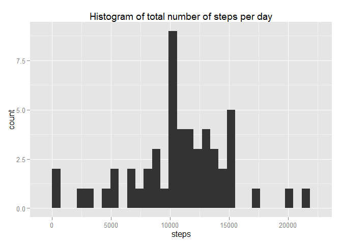
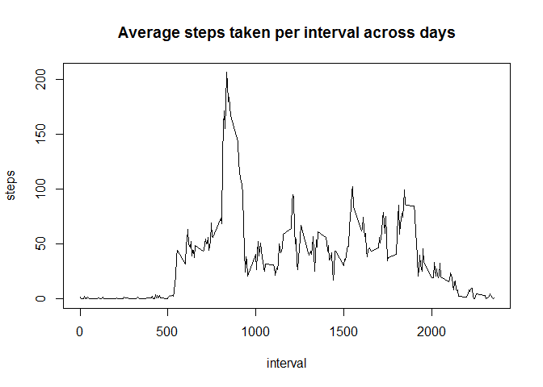
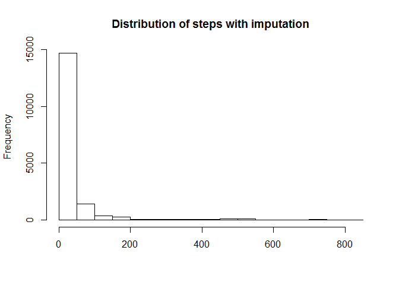
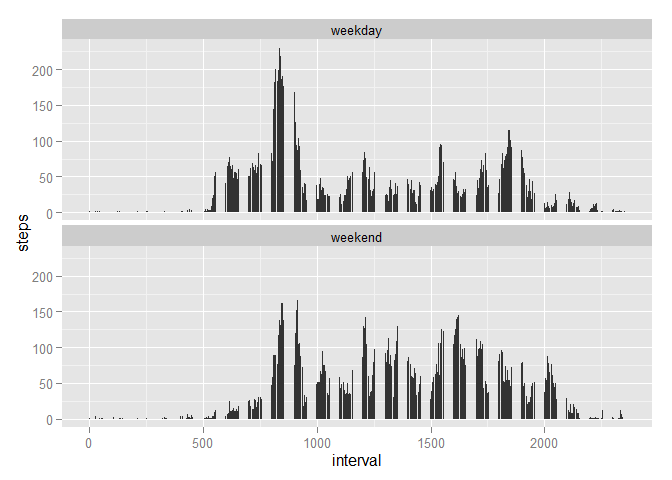

# Reproducible Research: Peer Assessment 1


## Loading and preprocessing the data
Show any code that is needed to  
1. Load the data (i.e. read.csv())  
2. Process/transform the data (if necessary) into a format suitable for your analysis


```r
library(plyr)
library(dplyr)
```

```
## Warning: package 'dplyr' was built under R version 3.1.2
```

```
## 
## Attaching package: 'dplyr'
## 
## The following objects are masked from 'package:plyr':
## 
##     arrange, count, desc, failwith, id, mutate, rename, summarise,
##     summarize
## 
## The following object is masked from 'package:stats':
## 
##     filter
## 
## The following objects are masked from 'package:base':
## 
##     intersect, setdiff, setequal, union
```

```r
library(ggplot2)

activities_raw<-read.csv("activity/activity.csv")
activities <- na.omit(activities_raw)
names(activities)
```

```
## [1] "steps"    "date"     "interval"
```


## What is mean total number of steps taken per day?

For this part of the assignment, you can ignore the missing values in the dataset.

Calculate the total number of steps taken per day


```r
steps_per_day<- ddply(activities, .(date), function(x) colSums(subset(x, select= c(steps))))
head(steps_per_day)
```

```
##         date steps
## 1 2012-10-02   126
## 2 2012-10-03 11352
## 3 2012-10-04 12116
## 4 2012-10-05 13294
## 5 2012-10-06 15420
## 6 2012-10-07 11015
```

Make a histogram of the total number of steps taken each day


```r
ggplot(steps_per_day,aes(x=steps)) + geom_histogram() + ggtitle("Histogram of total number of steps per day")
```

```
## stat_bin: binwidth defaulted to range/30. Use 'binwidth = x' to adjust this.
```

 

Calculate and report the mean and median of the total number of steps taken per day


```r
mean_steps <- mean(steps_per_day$steps)
median_steps<-median(steps_per_day$steps)
```

The mean and median of the imputed data is 1.0766189\times 10^{4} and 1.0765\times 10^{4} respectively.


## What is the average daily activity pattern?

Make a time series plot (i.e. type = "l") of the 5-minute interval (x-axis) and the average number of steps taken, averaged across all days (y-axis)


```r
step_by_interval<-ddply(activities, .(interval), function(x) colMeans(subset(x, select= c(steps))))
with(step_by_interval,plot(x=interval,y=steps,type="l",main="Average steps taken per interval across days"))
```

 

Which 5-minute interval, on average across all the days in the dataset, contains the maximum number of steps

```r
step_by_interval[which.max(step_by_interval$steps),]
```

```
##     interval    steps
## 104      835 206.1698
```
## Imputing missing values

Note that there are a number of days/intervals where there are missing values (coded as NA). The presence of missing days may introduce bias into some calculations or summaries of the data.

Calculate and report the total number of missing values in the dataset (i.e. the total number of rows with NAs)


```r
num_missing_values<-sum(is.na(activities_raw))
```

There are 2304 rows with missing values


Let us impute the missing values by using the average steps for that  interval across all days

```r
activities_imputed <- activities_raw  %>%
     merge(step_by_interval, all.x=TRUE, by="interval") %>%
     mutate(steps=ifelse(!is.na(steps.x),steps.x,steps.y  )) %>%
     select(date,interval,steps) 
```


Make a histogram of the total number of steps taken each day and Calculate and report the mean and median total number of steps taken per day. Do these values differ from the estimates from the first part of the assignment? What is the impact of imputing missing data on the estimates of the total daily number of steps


```r
mean_imputed<-mean(activities_imputed$steps)
median_imputed<-median(activities_imputed$steps)

diff_mean=mean_imputed -mean_steps
diff_median=median_imputed -median_steps
```

The mean of the imputed data is 37.3825996.
The median of the imputed data is 0.

The difference between the mean,median of the imputed and raw data is 


```r
diff_mean
```

```
## [1] -10728.81
```

```r
diff_median
```

```
## [1] -10765
```


Hisotgram of imputed steps


```r
hist(activities_imputed$steps, main="Distribution of steps with imputation",xlab="")
```

 


## Are there differences in activity patterns between weekdays and weekends?

For this part the weekdays() function may be of some help here. Use the dataset with the filled-in missing values for this part.

1. Create a new factor variable in the dataset with two levels – “weekday” and “weekend” indicating whether a given date is a weekday or weekend day.

2. Make a panel plot containing a time series plot (i.e. type = "l") of the 5-minute interval (x-axis) and the average number of steps taken, averaged across all weekday days or weekend days (y-axis). See the README file in the GitHub repository to see an example of what this plot should look like using simulated data.


```r
activities_imputed_day <- activities_imputed  %>% 
   mutate(day_type = ifelse (weekdays(as.Date(activities_imputed$date)) %in% c('Sunday','Saturday'), "weekend","weekday"))

ggplot(activities_imputed_day, aes(x=interval, y=steps))  + stat_summary(fun.y="mean", geom="bar") + facet_wrap(~day_type, ncol=1)
```

 

From the chart above, we see that on the weekdays, there is a 5minute interaval that had the most steps that exceeded any interval on the weekends. On the weekends, there is more steps walked than on the weekdays fro the same interval.
